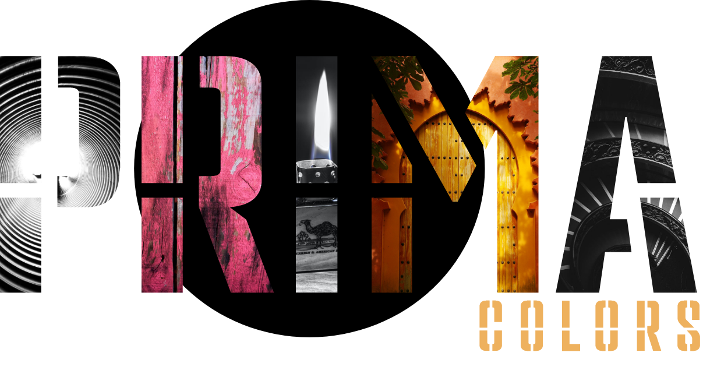
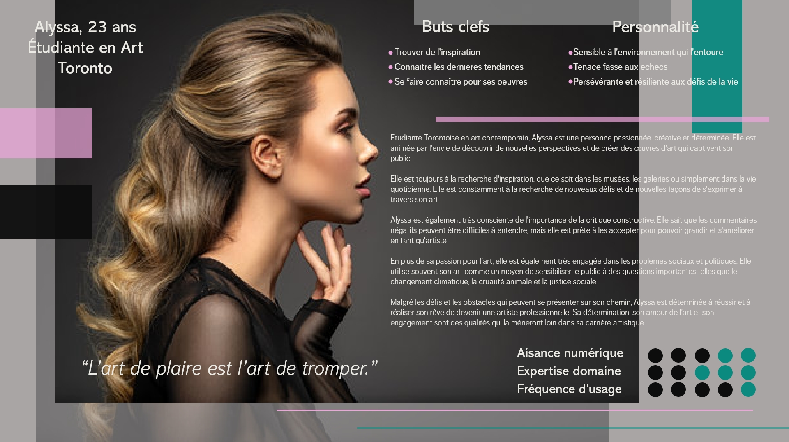
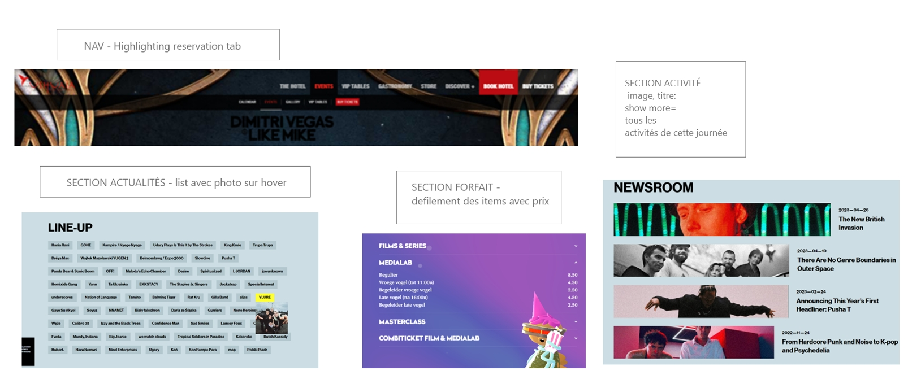
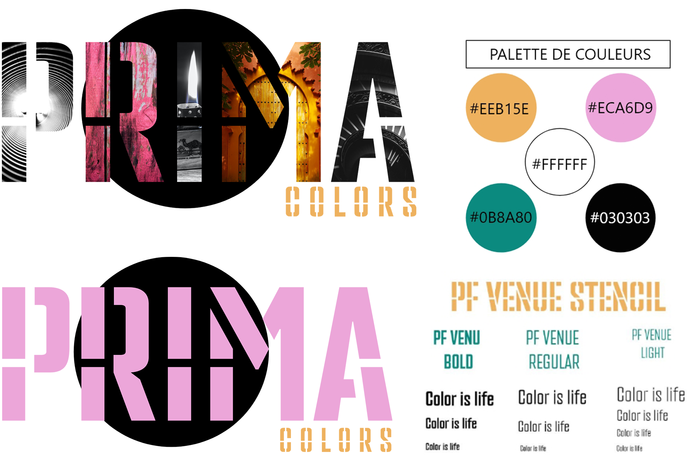

  

## Site Web pour un festival de couleurs

---
 Site web créé par : 
> - Marie-Eve Paquette
> - Shante Nicolaides
> - Mathieu Joyal
---

 

L'objectif de ce projet est de concevoir un site web captivant pour le Festival de Couleurs Prima-Colors. Nous mettrons en avant les diverses activités telles que concours, performances de DJ, course annuelle de couleurs, ateliers artistiques ect. Le tout doit être conçu de manière fonctionnelle, dynamique et intuitive pour une expérience utilisateur optimale.

Le festival vise une clientèle dynamique, âgée de 18 à 40 ans passionnée d'arts, de musique et d'activités variés. Le site web a pour mission de répondre à leurs attentes en offrant une expérience moderne, alliant technologie et plaisir.

## Voici des exemples de clientèles que le festival cible : 
| Catégorie | Description |
| --- | --- |   
**Les Amateurs d'Art et les Artistes Émergents** | Ce groupe comprend les passionnés d'art, les étudiants en art et les artistes émergents qui cherchent à découvrir de nouvelles inspirations et à élargir leurs horizons créatifs. 
| **Les Urbains Créatifs** |Les citadins qui valorisent l'expression artistique et qui sont attirés par la vie urbaine, la culture alternative et les espaces innovants. 
| **Les Aventuriers Culturels** | Les personnes avides de découvertes culturelles, qui aiment explorer de nouvelles expériences et participer à des événements novateurs. 
| **Les Influenceurs et les Blogueurs** |Les influenceurs et les blogueurs qui sont actifs dans les domaines de l'art, de la culture urbaine et de la créativité. 
| **Les Entrepreneurs Créatifs et les Innovateurs** |Ceux et celles qui cherchent à créer des synergies entre l'art et l'innovation, promouvant ainsi l'émergence de projets novateurs. 
| **Les Amateurs de Musique et de Performances** | Le Festival Prima-Colors propose également une programmation musicale variée et des performances de DJ en présentiel, attirant ainsi les amateurs de musique et de spectacles. 
 

Le Festival Prima-Colors vise à offrir une expérience riche et diversifiée à tous ces publics, créant ainsi un espace où l'expression artistique prend vie de manière inclusive et stimulante. 

---

>  ##  Prima-Colors

- Prima-Colors est un événement annuel incontournable qui attire chaque année des milliers de visiteurs. Cette célébration de l'art sous toutes ses formes se distingue par sa thématique unique et ses couleurs vibrantes. Pendant trois jours, les participants peuvent se plonger dans un monde d'inspiration, d'apprentissage et d'émerveillement. L'essence de ce festival est excentrique avec un mélange audacieux de couleurs et de formes qui repousse les limites de l'ordinaire. Prima-Colors croit fermement que l'art transcende les conventions, et ils promouvoient des talents qui osent expérimenter et innover.

### Le site est inspiré de 

### Le logo, la typographie et la palette de couleurs se déclinent comme tel;
  

---

##  Le site web sera créer avec diverses choix technologiques pour permettre la réalisation dynamique et intuitive voulu. 

    - Le développement : VS Code, JavaScript, PHP, Laravel, Html et Css. L'utilisation de Vue.js sera utilisé pour les composantes sans aucun doute également.
    - La planification : Click-Up et Adobe XD
    - La gestion de projet : SourceTree et Github. 
    - Le montage vidéo et la qualité/montage des photos seront réalisés par Photoshop et Premiere Pro.

## Forces et faiblesses des technologies
| Technologies | Forces | Faiblesses |
| --- | --- | :--- 
| **Visual Studio Code** | Gratuit / Open Source ,  Léger et rapide, Intégration avec Git | Nécessite des extensions pour certaines fonctionnalités 
| **JavaScript** |Interopérabilité, Exécution côté client  | Sécurité faible face aux attaques
| **PHP** | Polyvalent, Intégration avec BDD | Sécurité faible aux failles d'injection de SQL (mais mieux qu'avant)
| **Laravel** | Utilisation MVC, Système de routage puissant | Taille du framework
| **HTML** | Universalité, Interopérabilité  |Limitations fonctionnelles, Statique
| **CSS** | Réutilisation du style, Large compatibilité, Flexibilité  | Peut être complexe dans des scénarios avancés
| **Vue.JS** | Composants réutilisables, Rendu côté client (création réactive sans nécessairement rechragement de la page) | Taille du bundle lourd, 
| **Click-Up** | Polyvalent, Personnalisable d'après les projets, Visibilité pour le suivi de temps| Dépendance à Internet
| **Adobe XD** |Création rapide de prototypes interactifs, Possibilités de partage et de commentaires   |Fonctionnalités de conception limitées
| **SourceTree** | Visualisation des modifications, Intégration avec Git, Gestion graphique des branches|Mises à jour fréquentes
| **GitHub** |Hébergement de code, Sécurité, Collaboration entre membres du projet  |Dépendance à Git
| **PhotoShop** |Intégration avec d'autres logiciels Adobe , Précision et contrôle, Polyvalence, Large gamme de fonctionnalités (création, modification,manipulation d'images ect)|Ressources système : L'utilisation intensive des fonctionnalités avancées peut ralentir les ordinateurs moins puissants.
| **Premiere Pro** |Gestion de projet avancée, Performances, Intégration avec la suite Adobe  | Taille des fichiers, Dépendance à Adobe
 
## Présentation de la planification du travail synthèse

1. La planification est catégorisé comme tel:

    >- analyses des besoins 
    >- présentation du concept 
    >- présentation des choix technologies 
    >- rédaction de la planification du fichier markdown 

2. Design 

3. Intégration front-end 

4. Intégration back-end 

5. Révision du projet 

## Apport global des membres de l'équipe 

>- Marie-Eve – contenu, front end, components et intégration/contenu du readme,  
>- Shanté – design du site et contenu du readme, front end, base de données, back end des pages Actualités et Activités  
>- Mathieu – organisation du click up, base de données, back end et front end de l'admin 

La motivation est le moteur qui propulse notre équipe vers le succès. Chacun d'entre nous est animé par le désir ardent de mener à bien notre projet, conscient que la complétion et la qualité sont des piliers essentiels de notre réussite collective.

Lorsqu'il s'agit de répartir la charge de travail, nous prônons l'équité. Notre objectif n'est pas de compartimenter le projet en parts égales de 33%, 33%, 33%, mais plutôt de garantir que chacun contribue de manière égale et investit un nombre d'heures similaire. Cette approche assure une distribution équilibrée des responsabilités, renforçant ainsi notre cohésion d'équipe.

Notre organisation est l'un de nos atouts majeurs. La communication est au cœur de notre démarche, et nous avons consacré un temps considérable à la planification du projet, à la conception, à la gestion de la base de données, ainsi qu'à l'utilisation de l'outil de gestion de projet, ClickUp, entre autres. Cette préparation minutieuse nous permet de minimiser les problèmes potentiels et les conflits. Chacun de nous travaille de manière autonome sur sa partie spécifique du projet, ce qui élimine les conflits de programmation inutiles.

Nous maintenons un rythme de communication constant, avec des débriefings quotidiens pour partager nos avancements, nos objectifs à court terme et, le cas échéant, les problèmes qui surgissent. Cette transparence favorise la résolution collective des défis et la recherche de solutions ensemble. En fin de compte, notre équipe est solidement unie par la motivation, l'équité et une communication efficace, ce qui nous permet d'avancer avec succès vers l'accomplissement de nos objectifs.

## Liens: 

>- clickup:  https://app.clickup.com/9003192605/v/l/s/90100440995
>- Github:   https://github.com/Mathieu-Joyal/prima_colors_pw2
