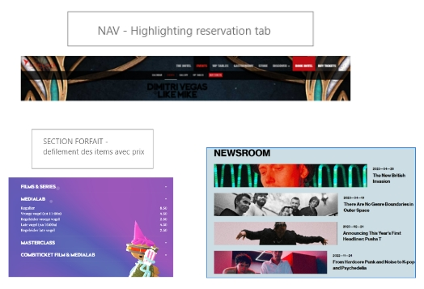
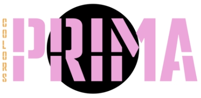
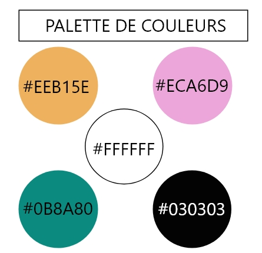
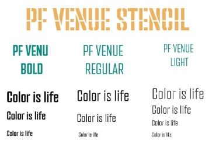

# Projet-web-2
Sit web pour un festival de couleurs:  Prima-Colors
# Projet Synthèse 

## Site Web pour un festival de couleurs

---
 Site web créé par : 
> - Marie-Eve Paquette
> - Shante Nicolaides
> - Mathieu Joyal
---
 

L'objectif de ce projet est de concevoir un site web captivant pour le Festival de Couleurs Prima-Colors. Nous mettrons en avant les diverses activités telles que concours, performances de DJ, course annuelle de couleurs, ateliers artistiques ect. Le tout doit être conçu de manière fonctionnelle, dynamique et intuitive pour une expérience utilisateur optimale.

Le festival vise une clientèle dynamique, âgée de 18 à 40 ans passionnée d'arts, de musique et d'activités variés. Le site web a pour mission de répondre à leurs attentes en offrant une expérience moderne, alliant technologie et plaisir.

---

>  ##  Prima-Colors

- Prima-Colors est un événement annuel incontournable qui attire chaque année des milliers de visiteurs. Cette célébration de l'art sous toutes ses formes se distingue par sa thématique unique et ses couleurs vibrantes. Pendant trois jours, les participants peuvent se plonger dans un monde d'inspiration, d'apprentissage et d'émerveillement. 

### Le site est inspiré de 

### Le logo, la typographie et la palette de couleurs se déclinent comme tel;

---

##  Le site web sera créer avec diverses choix technologiques pour permettre la réalisation dynamique et intuitive voulu. 

    - Le développement : VS Code, JavaScript, PHP, Laravel, Html et Css. L'utilisation de Vue.js sera utilisé    pour les composantes sans aucun doute également.
    - La planification : Click-Up et Adobe XD
    - La gestion de projet : SourceTree et Github. 
    - Le montage vidéo et la qualité/montage des photos seront réalisés par Photoshop et Premiere Pro.

## Forces et faiblesses des technologies
| Technologies | Forces | Faiblesses |
| --- | --- | :---: 
|   
**Visual Studio Code** | Gratuit / Open Source ,  Léger et rapide, Intégration avec Git | Nécessite des extensions pour certaines fonctionnalités 
| **JavaScript** |Interopérabilité, Exécution côté client  | Sécurité faible face aux attaques
| **PHP** | Polyvalent, Intégration avec BDD | Sécurité faible aux failles d'injection de SQL (mais mieux qu'avant)
| **Laravel** | Utilisation MVC, Système de routage puissant | Taille du framework
| **HTML** | Universalité, Interopérabilité  |Limitations fonctionnelles, Statique
| **CSS** | Réutilisation du style, Large compatibilité, Flexibilité  | Peut être complexe dans des scénarios avancés
| **Vue.JS** | Composants réutilisables, Rendu côté client (création réactive sans nécessairement rechragement de la page) | Taille du bundle lourd, 
| **Click-Up** | Polyvalent, Personnalisable d'après les projets, Visibilité pour le suivi de temps| Dépendance à Internet
| **Adobe XD** |Création rapide de prototypes interactifs, Possibilités de partage et de commentaires   |Fonctionnalités de conception limitées
| **SourceTree** | Visualisation des modifications, Intégration avec Git, Gestion graphique des branches|Mises à jour fréquentes
| **GitHub** |Hébergement de code, Sécurité, Collaboration entre membres du projet  |Dépendance à Git
| **PhotoShop** |Intégration avec d'autres logiciels Adobe , Précision et contrôle, Polyvalence, Large gamme de fonctionnalités (création, modification,manipulation d'images ect)|Ressources système : L'utilisation intensive des fonctionnalités avancées peut ralentir les ordinateurs moins puissants.
| **Premiere Pro** |Gestion de projet avancée, Performances, Intégration avec la suite Adobe  | Taille des fichiers, Dépendance à Adobe
 

